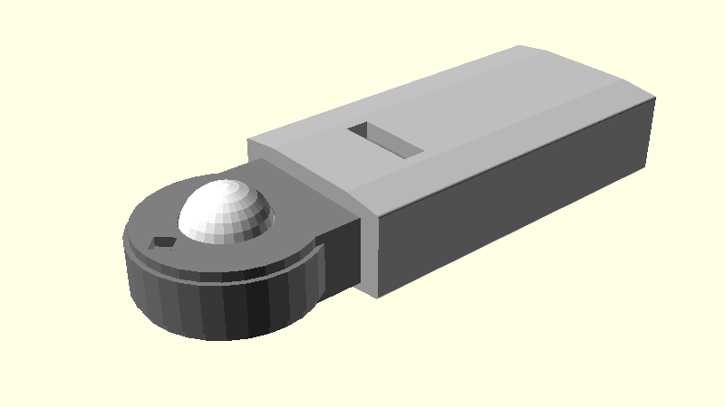
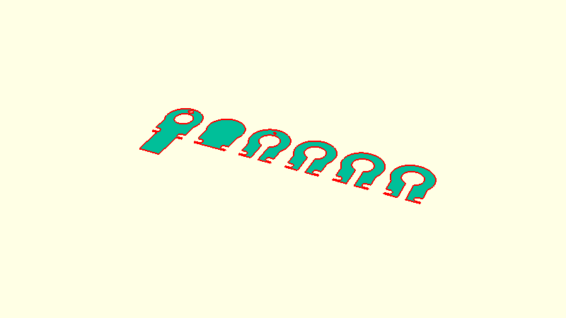

# Lux

A custom lux meter.

## Enclosure

Laser-cut plates added to an purchased enclosure.

### Mock-up

### Plates

### Outlines

## Hat tips

https://www.instructables.com/ESP8266-Pro-Tips/

https://www.instructables.com/ESP-12F-ESP8266-Module-Minimal-Breadboard-for-Flas/

https://randomnerdtutorials.com/esp8266-nodemcu-bh1750-ambient-light-sensor/

https://learn.sparkfun.com/tutorials/esp8266-thing-hookup-guide/using-the-arduino-addon

https://randomnerdtutorials.com/esp8266-pinout-reference-gpios/

https://randomnerdtutorials.com/esp8266-0-96-inch-oled-display-with-arduino-ide/
